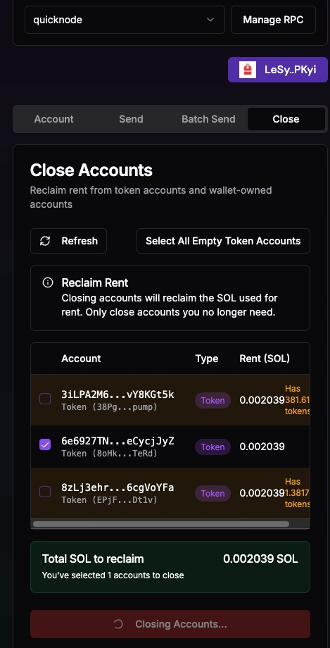

# Solana Wallet Utils

Welcome to the Solana Wallet Utils dApp! This application is designed to simplify the management of Solana wallets and enhance your experience with the Solana blockchain.

## Features

- **Account Management**: Connect your wallet to view account details and manage your assets efficiently.
- **Close Empty Token Accounts**: Easily close any empty token accounts to keep your wallet organized and free of unnecessary clutter.
- **Batch Transfer SOL**: Send SOL in batches to multiple addresses, saving you time and effort when managing your transactions.

## Deployment

This dApp has been deployed and is accessible at [https://solana-wallet-utils.vercel.app](https://solana-wallet-utils.vercel.app/). Connect your wallet and start utilizing these features today!

## Getting Started

To get started, simply connect your Solana wallet and explore the various functionalities available. Whether you need to manage your accounts or perform transactions, Solana Wallet Utils has you covered.
